# Projeto: Consultas com Nutricionista

Resolução de uma atividade (Situação Problema) com linguagem C

## Conhecimentos
- Lógica de programação estrutural
- Vetores **[]**
- Estruturas **struct**
- Funções e procedimentos
- Resolução de problemas
- Requisitos e modelagem de dados
- UML - Diagrama de Casos de Uso

### Contextualização
O consultório da nutricionista Dra. Ângela Maria necessita de um sistema de agendamento de consultas, você como programador e empreendedor pretende prestar este serviço como PJ

## Documento de Requisitos Programa de Agendamento de Consultas
O documento deste projeto consiste na descrição de cada requisito separado por funcionais e não funcionais, proridade de desenvolvimento (Essencial, Importante e Desejável) e uma ilustração através de Diagramas de Casos de Uso da UML ()
### Requisitos
|Não Funcionais|Prioridade|
|:-:|-|
|RN001 - Linguagem C|_Essencial_|
|RN002 - Programação estrutural e funcional|_Essencial_|

|Funcionais|Prioridade|
|:-:|-|
|RF001 - Cadastro de **Pacientes** com os campos (CPF, nomeCompleto, telefone) 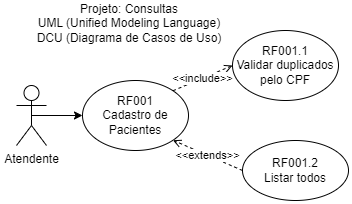|_Essencial_|
|RF002 - Cadastro de **Consultas** contemplando os campos (data, hora, paciente, nomeAtendente) 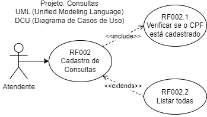|_Essencial_|
|RF003 - Cancelar/Excluir consulta 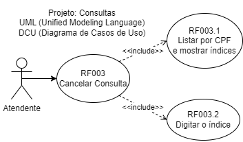|_Importante_|
|RF004 - Alterar data e horário da consulta 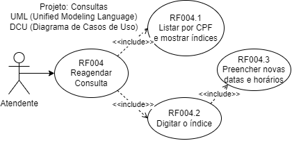|_Desejável_|
|RF005 - Criar menu com todas estas opções e a opção de Sair 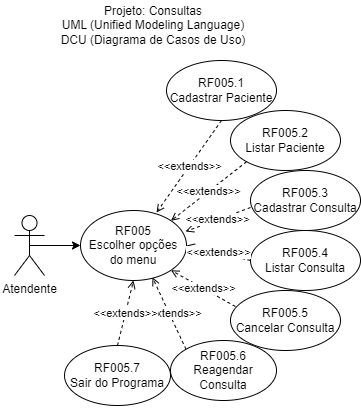|_Essencial_|

|OBS:|
|-|
|Não é necessário realizar a persistência de dados, pois o sistema será implantado em uma VM em Núvem com disponibilidade de 24horas|

### Para testar
- 1 Fazer downoad deste repositório
- 2 Executar o código consultas.c com compilador C **DevC++**

## Resultados (Testes unitários)
|Requisito|Evidência|
|-|:-:|
|RF001 RF005|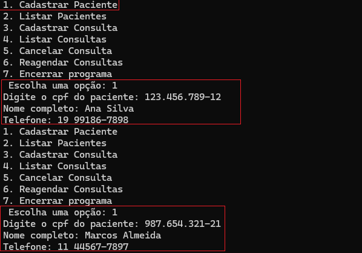|
|RF001.1|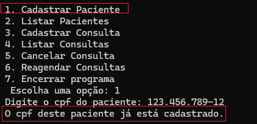|
|RF001|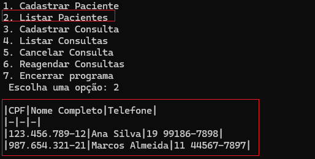|
|RF002|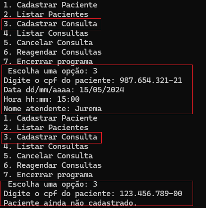|
|RF002|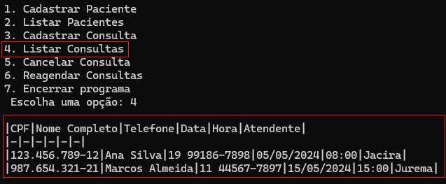|
|RF003|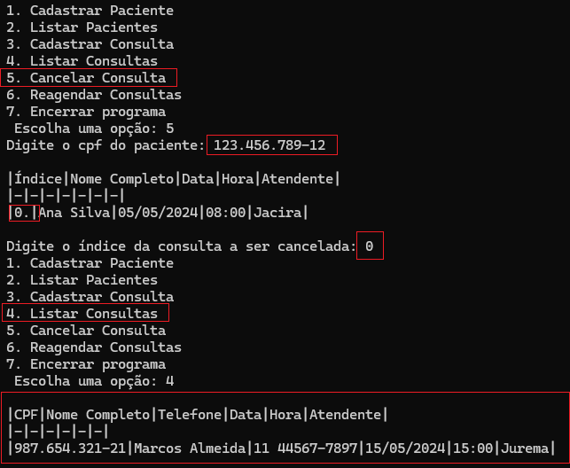|
|RF004|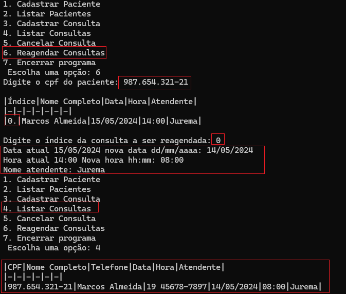|
